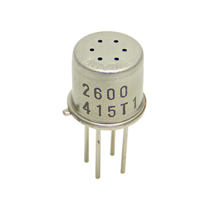
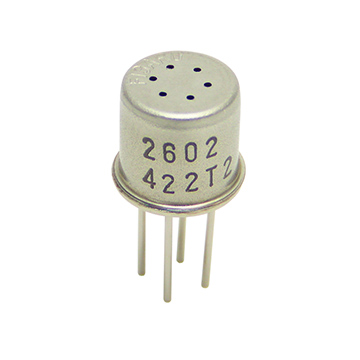
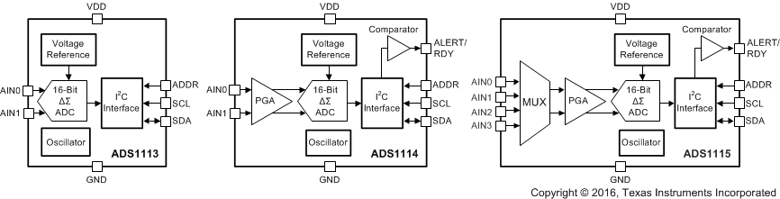

# Hardware

## Inleiding

Bedoeling is dus om te proberen of we met behulp van de twee sensoren met een
gas-gevoelige impedantie het mogelijk is om geurhinder te meten.

## bill of materials

| foto | beschrijving | bestellen |
| ---- | ------------ | --------- |
| [foto](docs/raspberry_pi_pack.jpg) | Raspberry PI 3B+ pack | [KIWI electronics](https://www.kiwi-electronics.nl/raspberry-pi/board-and-kits/raspberry-pi-3-model-b-plus-basic-pack-red-white) |
| [foto](docs/raspberry_pi_proto_hat.jpg) | RPI prototype hat | [AliExpress](https://nl.aliexpress.com/item/DIY-Proto-HAT-Shield-for-Raspberry-Pi-2-Model-B-B-A-Red/32340467652.html?spm=a2g0s.9042311.0.0.3a6d4c4dc3T5iy) |
| [foto](docs/TGS2600_TGS2602_TGS2603_TGS2620_dev_board.jpg) | TGS2600 en  TGS2602 sensors | [AliExpress](https://nl.aliexpress.com/item/TGS2600-TGS2602-TGS2603-TGS2620-fume-rook-gas-air-quality-sensor-module-2602-2600-2603-2620/32959547474.html?spm=a2g0s.9042311.0.0.4a964c4dz7svL1A) |
| [foto](docs/DS3231_breakout_board.jpg) | DS3231-Precision-RTC breakout board | [AliExpress](https://nl.aliexpress.com/item/1pc-DS3231-Precision-RTC-Module-Memory-Module-for-Arduino-Raspberry-Pi/32678071421.html?spm=a2g0s.9042311.0.0.717c4c4dntX0NT) |
| [foto](docs/ADS115_breakout_board.jpg) | ADS1115, LNA+ADC breakout board | [AliExpress](https://nl.aliexpress.com/item/CJMCU-ADS1115-subminiature-16-bit-precision-AD-converter-ADC-Development-board-module-free-shipping/32328001325.html?spm=a2g0s.9042311.0.0.717c4c4dntX0NT) |
| [foto](docs/100-stks-Enkele-rij-vrouwelijke-2-54-MM-afstand-Pin-socket-vrouwelijke-Header-Connector-2-P.jpg) | 2.54mm single row 4 pin and 8 pin female header | [AliExpress](https://nl.aliexpress.com/item/100pcs-Single-row-female-2-54MM-spacing-Pin-socket-female-Header-Connector-2P-3P-4P-5P/32721717161.html?spm=a2g0s.9042311.0.0.27424c4dqbboRC) |

## Raspberry pi 3B+

Dit is de computer die de sensoren uitleest en gegevens lokaal opslaat.
Best wel een krachtig apparaat om enkel sensoren uit te lezen. Kan goedkoper
met bv. een arduino, maar de pi is oh zo handig in gebruik.

  -  Broadcom BCM2837B0, Cortex-A53 (ARMv8) 64-bit SoC @ 1.4GHz
  -  1GB LPDDR2 SDRAM
  -  2.4GHz and 5GHz IEEE 802.11.b/g/n/ac wireless LAN, Bluetooth 4.2, BLE
  -  Gigabit Ethernet over USB 2.0 (maximum throughput 300 Mbps)
  -  Extended 40-pin GPIO header
  -  Full-size HDMI
  -  4 USB 2.0 ports
  -  CSI camera port for connecting a Raspberry Pi camera
  -  DSI display port for connecting a Raspberry Pi touchscreen display
  -  4-pole stereo output and composite video port
  -  Micro SD port for loading your operating system and storing data
  -  5V/2.5A DC power input
  -  Power-over-Ethernet (PoE) support (requires separate PoE HAT)

  Meer details op https://www.raspberrypi.org/products/raspberry-pi-3-model-b-plus/

## sensors

|   | TGS2600 | TGS 26002 |
| - | ------- | --------- |
|   |  |  |
| Target gases | Air contaminants (hydrogen, ethanol, etc.) | Air contaminants (VOCs, ammonia, H2S, etc.) |
| Typical detection range | 1 - 30ppm of H2 | 1 - 30ppm of EtOH |
| Sensing principle | MOS type Precautions for use | MOS type Precautions for use |
| Heater Voltage | 5.0V | 5.0V |
| Circuit Voltage | 5.0V | 5.0V |
| Power consumption | 210mW | 280mW |
| Dimensions | φ9.2×7.8mm | φ9.2×7.8mm |
| Weight | Approx. 1.1g | Approx. 1.1g |
|   | [product information](docs/TGS2600B00_0913.pdf) | [product information](docs/TGS2602-B00_0615.pdf) |
|   | [product page](http://www.figarosensor.com/products/entry/tgs2600.html) | [product page](http://www.figarosensor.com/products/entry/tgs2602.html) |

## ADS1115

http://www.ti.com/product/ADS1115

### introduction

The ADS1113, ADS1114, and ADS1115 devices (ADS111x) are precision, low-power,
16-bit, I2C-compatible, analog-to-digital converters (ADCs) offered in an
ultra-small, leadless, X2QFN-10 package, and a VSSOP-10 package. The ADS111x
devices incorporate a low-drift voltage reference and an oscillator. The
ADS1114 and ADS1115 also incorporate a programmable gain amplifier (PGA) and a
digital comparator. These features, along with a wide operating supply range,
make the ADS111x well suited for power- and space-constrained, sensor
measurement applications.

The ADS111x perform conversions at data rates up to 860 samples per second
(SPS). The PGA offers input ranges from ±256 mV to ±6.144 V, allowing precise
large- and small-signal measurements. The ADS1115 features an input multiplexer
(MUX) that allows two differential or four single-ended input measurements. Use
the digital comparator in the ADS1114 and ADS1115 for under- and overvoltage
detection.

The ADS111x operate in either continuous-conversion mode or single-shot mode.
The devices are automatically powered down after one conversion in single-shot
mode; therefore, power consumption is significantly reduced during idle
periods.

### Features

- Ultra-Small X2QFN Package:
- 2 mm × 1.5 mm × 0.4 mm
- Wide Supply Range: 2.0 V to 5.5 V
- Low Current Consumption: 150 µA
- (Continuous-Conversion Mode)
- Programmable Data

### functional diagram

